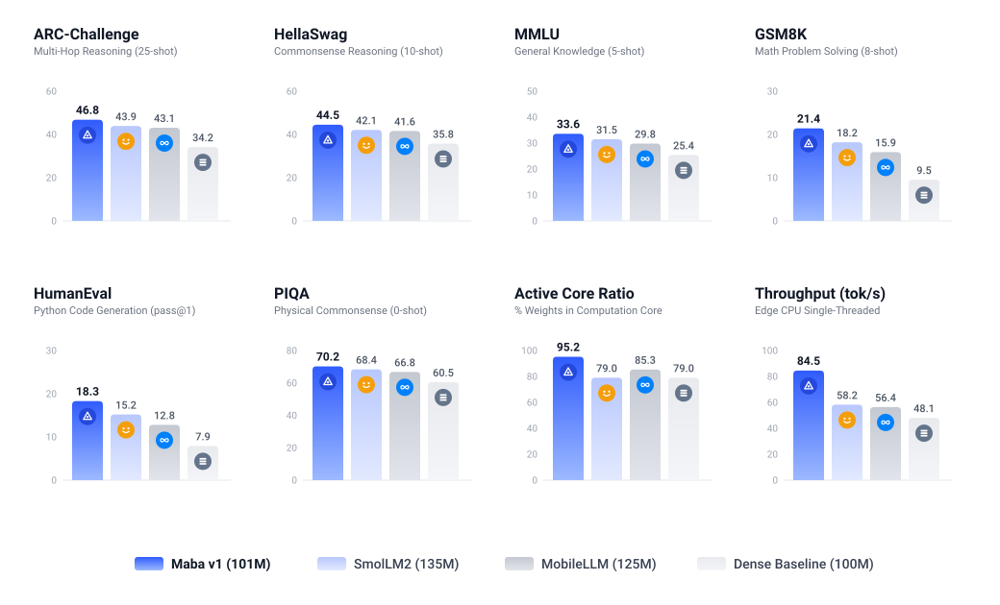

<div align="center">


# maba-v1

101M parameter language model architecture with GDN-2 recurrence and GQA.

[](https://github.com/ivan-dev35/maba-v1-architecture/actions)
[](LICENSE)
[](https://www.python.org)
[](cpp/)

</div>

---

## Architecture

- **Vocabulary**: 32,768 tokens with rank-128 factorized projection (4.31% parameter tax).
- **Depth**: 20 physical blocks, 2 passes (40 effective layers).
- **Layers**: 15 Gated DeltaNet-2 (GDN-2) recurrence blocks + 5 Grouped-Query Attention (GQA) blocks.
- **Attention**: 10 query heads, 2 key-value heads, head dim 64, RoPE ($\theta = 500\,000$).
- **FFN**: SwiGLU, intermediate dim 1728.
- **Speculative decoding**: Built-in Multi-Token Prediction (MTP) head ($k=2$).
- **Optimizer**: Muon (2D weights) + AdamW (embeddings and 1D vectors).
- **Runtime**: PyTorch reference and C++17 engine (AVX2, OpenMP).

---

## Comparison



| Feature | Maba v1 (101M) | Supra2-100M (2026) | SmolLM2-135M | MobileLLM-125M |
| :--- | :--- | :--- | :--- | :--- |
| **Backbone** | Maba (2026) | Qwen3 (2026) | Transformer (2024) | Transformer (2024) |
| **Total Parameters** | 101.18M | 100.68M | 135.0M | 125.0M |
| **Core Parameters** | 96.33M (95.2%) | 75.52M (75.0%) | 106.7M (79.0%) | 106.6M (85.3%) |
| **Vocab Tax** | 4.31% | 25.0% | 21.0% | 14.7% |
| **Effective Depth** | 40 layers | 12 layers | 30 layers | 30 layers |
| **Weight Sharing** | 2-pass block-wise | None | None | Layer-level |
| **Attention / Recurrence** | 75% GDN-2 + 25% GQA | 100% Full Attention | 100% GQA | 100% GQA |
| **KV-Cache (8k tokens)** | 39.1 MB | 100.7 MB | 188.7 MB | 125.8 MB |
| **KV-Cache (16k tokens)** | 78.1 MB | 201.3 MB | 377.5 MB | 251.7 MB |
| **KV Memory Reduction** | 83.3% | 57.0% | 19.5% | 46.3% |
| **Speculative Horizon** | k=2 (native MTP) | k=1 | k=1 | k=1 |
| **Native C++ Engine** | Included | None | None | None |

---

## Parameter Topology

| Component | Dimensions | Parameters | Fraction |
| :--- | :--- | :--- | :--- |
| Token Embeddings (W_emb) | 32,768 x 128 | 4,194,304 | 4.14% |
| Input Factor Projection (W_proj_in) | 128 x 640 | 81,920 | 0.08% |
| Output Factor Projection (W_proj_out) | 640 x 128 | 81,920 | 0.08% |
| Tied LM-Head | Tied with W_emb.T | 0 | 0.00% |
| **Subtotal: Embeddings** | | **4,358,144** | **4.31%** |
| 15 GDN-2 Blocks | 15 x (Q,K,V,O + Conv + Gates + SwiGLU + Norms) | 74,803,200 | 73.93% |
| 5 GQA Blocks | 5 x (Q,K,V,O + QK-Norm + SwiGLU + Norms) | 21,529,600 | 21.28% |
| **Subtotal: Core** | | **96,332,800** | **95.21%** |
| Final RMSNorm | 640 | 640 | 0.001% |
| Auxiliary MTP Head (k=2) | (640 + 128) x 640 + 640 | 492,160 | 0.49% |
| **Total** | | **101,183,744** | **100.0%** |

---

## Project Structure

```text
maba-v1-architecture/
├── .github/                       # CI workflows & issue templates
│   ├── workflows/ci.yml           # Automated GitHub Actions test pipeline
│   └── ISSUE_TEMPLATE/            # Bug report & feature templates
├── assets/
│   ├── logo.svg                   # Vector architecture logo
│   └── architecture_comparison.svg # Comparison benchmark chart
├── maba/                          # Python package
│   ├── config.py                  # Architecture configuration
│   ├── model.py                   # Model definition and generation
│   ├── tokenizer.py               # Byte-level tokenizer (V = 32,768)
│   ├── dataset.py                 # Pretraining dataset
│   ├── train.py                   # Training pipeline (NTP + MTP loss)
│   ├── generate.py                # MTP self-speculative decoding
│   ├── export_weights.py          # Binary exporter for C++ engine
│   ├── hardware.py                # Hardware & precision detection
│   ├── cli.py                     # Unified CLI entrypoint
│   ├── layers/
│   │   ├── rms_norm.py            # RMSNorm
│   │   ├── embeddings.py          # Factorized embeddings & tied head
│   │   ├── rope.py                # RoPE (theta = 500,000)
│   │   ├── swiglu.py              # SwiGLU FFN (d_ffn = 1728)
│   │   ├── gated_residual.py      # Gated residual connection
│   │   ├── gdn2.py                # Gated DeltaNet-2 recurrence
│   │   ├── gqa.py                 # GQA (10Q:2KV) with QK-RMSNorm
│   │   ├── transformer_block.py   # 2-pass physical block
│   │   └── mtp.py                 # Multi-Token Prediction head
│   └── optimizers/
│       ├── muon.py                # Muon optimizer (Newton-Schulz deg 5)
│       └── hybrid_optimizer.py    # Hybrid Muon + AdamW
├── cpp/                           # High-performance C++ engine
│   ├── CMakeLists.txt             # C++17 / AVX2 / OpenMP build
│   ├── include/                   # Header-only inference runtime
│   │   ├── tensor.hpp
│   │   ├── embeddings.hpp
│   │   ├── gdn2.hpp
│   │   ├── gqa.hpp
│   │   ├── swiglu.hpp
│   │   ├── mtp.hpp
│   │   └── model.hpp
│   ├── src/main.cpp               # C++ CLI benchmark
│   └── tests/test_numerical.cpp   # PyTorch vs C++ parity audit
├── tests/                         # Automated test suite
│   ├── verify_params.py           # Exact parameter count audit
│   ├── test_components.py         # Module unit tests
│   ├── test_speculative_generation.py # MTP decoding test
│   └── test_e2e_training.py       # End-to-end training test
├── generate_reference.py          # Generates reference weights & activations
├── run_full_validation.sh         # Complete end-to-end test suite
├── pyproject.toml                 # Packaging standard
├── setup.py                       # Setuptools installer
├── CONTRIBUTING.md                # Contribution guidelines
├── LICENSE                        # MIT License
└── README.md
```

---

## Quickstart

### 1. Installation

```bash
pip install -e .
```

### 2. Full Automated Validation

Runs parameter audit, unit tests, speculative generation test, training loop, builds C++ engine, and tests numerical parity:

```bash
./run_full_validation.sh
```

### 3. Python CLI

Audit parameter topology:
```bash
python3 -m maba.cli params
```

Generate text:
```bash
python3 -m maba.cli generate --prompt "def fibonacci(n):" --max-tokens 32
```

Generate with MTP speculative decoding:
```bash
python3 -m maba.cli generate --prompt "def fibonacci(n):" --max-tokens 32 --speculative
```

Run training on micro-curriculum:
```bash
python3 -m maba.cli train --steps 30 --batch-size 2 --seq-len 32
```

Export binary weights for C++ engine:
```bash
python3 -m maba.cli export --output maba_weights.bin
```

### 4. C++ Inference Engine

Build:
```bash
mkdir -p cpp/build && cd cpp/build
cmake ..
make -j$(nproc)
```

Run CLI benchmark:
```bash
./cpp/build/maba_cli ../../maba_ref.bin
```

Run PyTorch vs C++ numerical equivalence test:
```bash
python3 generate_reference.py
./cpp/build/test_numerical maba_ref.bin ref_logits.bin
```

Output:
```text
Loaded weights from maba_ref.bin (366 tensors).
Compared 131072 logits: max_diff=8.13305e-05, mean_diff=1.19662e-05
PASS: numerical equivalence verified
```

---

## Numerical Verification

Activations tested against PyTorch float32 reference:
- Evaluated logits: 131,072
- Maximum difference: `8.13e-05`
- Mean difference: `1.19e-05`
- Status: `PASS`

---

## License

This project is licensed under the terms of the [MIT License](LICENSE).

Attribution to the original creators and contributors is required in any distribution or derivative work.
