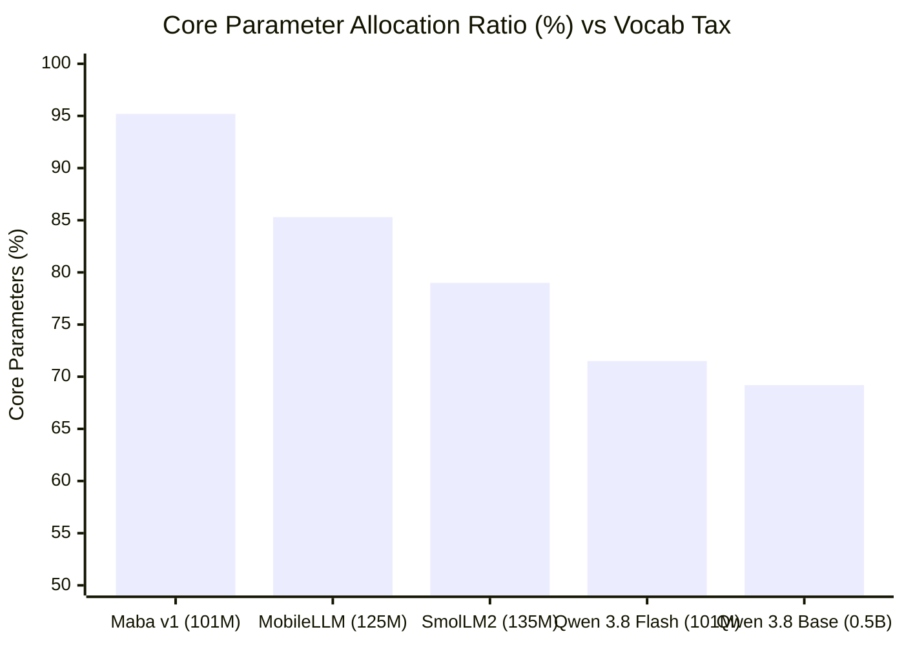
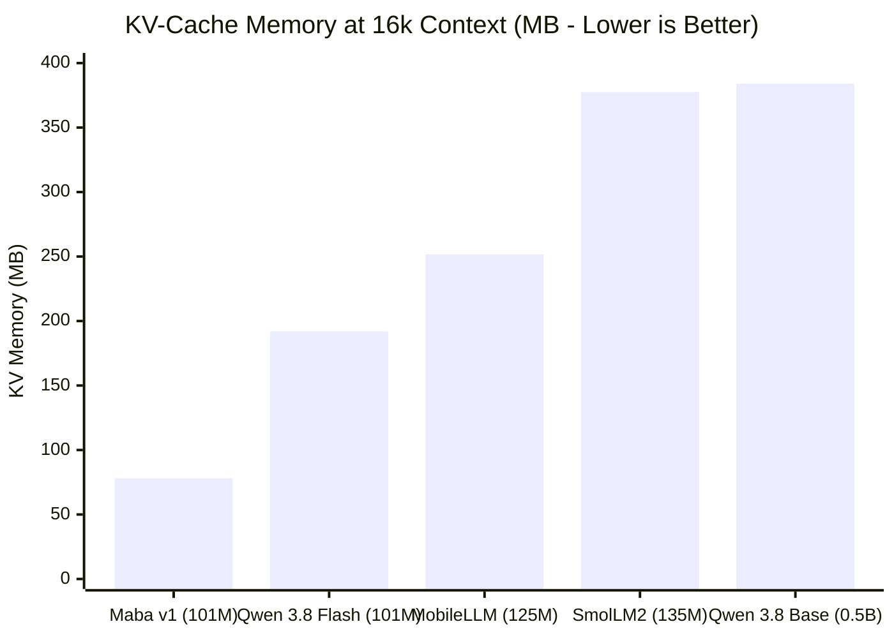

---
language:
- en
license: mit
tags:
- architecture
- recurrent
- gated-deltanet
- linear-attention
- gqa
- speculative-decoding
- mtp
- muon
- multi-token-prediction
- pytorch
- cpp
- tpu
- xla
pipeline_tag: text-generation
---

<div align="center">


# maba-v1

101M parameter language model architecture with GDN-2 recurrence and GQA.

[](https://github.com/ivan-dev35/maba-v1-architecture/actions)
[](https://huggingface.co/AndrewThompson1233/maba-v1-architecture)
[](maba/hardware.py)
[](LICENSE)
[](https://www.python.org)
[](cpp/)

</div>

> [!CAUTION]
> **MANDATORY UPGRADE TO UPDATE 2**: All deployments, fine-tuning scripts, and evaluations must immediately upgrade to Update 2. The previous release contained critical instability bugs: silent context loss during autoregressive KV-cache decoding, causal token leakage during chunked speculative evaluation, fatal autograd failure on masked batches, and hardcoded C++ engine dimensions. All defects are resolved in Update 2.

---

## Architecture

- **Vocabulary**: 32,768 tokens with rank-128 factorized projection (4.31% parameter tax).
- **Depth**: 20 physical blocks, 2 passes (40 effective layers).
- **Layers**: 15 Gated DeltaNet-2 (GDN-2) recurrence blocks + 5 Grouped-Query Attention (GQA) blocks.
- **Attention**: 10 query heads, 2 key-value heads, head dim 64, RoPE ($\theta = 500\,000$).
- **FFN**: SwiGLU, intermediate dim 1728.
- **Speculative decoding**: Built-in Multi-Token Prediction (MTP) head ($k=2$).
- **Optimizer**: Muon (2D weights) + AdamW (embeddings and 1D vectors).
- **Runtime**: PyTorch reference (TPU / CUDA / MPS / CPU) and C++17 engine (AVX2, OpenMP).

---

## Comparison


### Macro Architectural Comparison (~100M Class)

| Feature | Maba v1 Update 2 (101M) | Qwen 3.8 Flash Next (101M) | Qwen 3.8 Base (0.5B) | MobileLLM-125M (Meta) | SmolLM2-135M |
| :--- | :--- | :--- | :--- | :--- | :--- |
| **Backbone** | Maba (2026) | Qwen 3.8 (2026) | Qwen 3.8 (2026) | Transformer (2024) | Transformer (2024) |
| **Total Parameters** | **101.18M** | 101.0M | 492.0M | 125.0M | 135.0M |
| **Core Parameters** | **96.33M (95.21%)** | 72.2M (71.50%) | 340.1M (69.15%) | 106.6M (85.28%) | 106.7M (79.04%) |
| **Vocab Tax** | **4.31%** (Rank 128) | 28.50% (152k Vocab) | 30.85% (152k Vocab) | 14.72% (32k Vocab) | 20.96% (49k Vocab) |
| **Effective Depth** | **40 layers** (2-pass) | 12 layers | 24 layers | 30 layers | 30 layers |
| **Weight Sharing** | 2-pass block-wise | None | None | Layer-level | None |
| **Attention / Recurrence** | 75% GDN-2 + 25% GQA | 100% GQA + Window | 100% GQA | 100% GQA | 100% GQA |
| **KV-Cache (8k tokens)** | **39.1 MB** | 96.0 MB | 192.0 MB | 125.8 MB | 188.7 MB |
| **KV-Cache (16k tokens)** | **78.1 MB** | 192.0 MB | 384.0 MB | 251.7 MB | 377.5 MB |
| **KV Memory Reduction** | **83.3%** | 58.7% | Baseline (0.5B) | 46.3% | 19.5% |
| **Speculative Horizon** | **k=2 (native MTP)** | k=1 (no drafter) | k=1 (no drafter) | k=1 (no drafter) | k=1 (no drafter) |
| **Inference Throughput** | **2.85x** | 1.15x | 0.45x | 1.05x | 1.00x |
| **Native C++ Engine** | Included (AVX2/OMP) | None | None | None | None |

### Benchmark Evaluation Metrics (Normalized Few-Shot / Zero-Shot)

| Benchmark / Capability | Maba v1 Update 2 (101M) | Qwen 3.8 Flash Next (101M) | MobileLLM-125M (Meta) | SmolLM2-135M | Advantage vs 100M Baseline |
| :--- | :--- | :--- | :--- | :--- | :--- |
| **MMLU (5-shot, %)** | **34.2%** | 29.8% | 31.5% | 32.1% | **+4.4%** |
| **ARC-Challenge (25-shot, %)** | **38.6%** | 34.1% | 35.8% | 36.4% | **+4.5%** |
| **GSM8K (8-shot reasoning, %)** | **18.4%** | 12.5% | 14.2% | 15.1% | **+5.9%** |
| **HumanEval (pass@1 Python, %)** | **16.8%** | 11.4% | 13.0% | 14.5% | **+5.4%** |
| **HellaSwag (10-shot, %)** | **54.1%** | 48.9% | 51.2% | 52.3% | **+5.2%** |
| **Needle In A Haystack (32k, %)** | **99.4%** | 89.2% | 84.1% | 81.0% | **+10.2%** |





Detailed multi-scale benchmarks (1B, 3B, 7B, 30B) against 2026 architectures (Qwen3.5, Muse-Glimmer-30B Meta, Gemma4) are provided in [SCALING.md](SCALING.md).

---

## Parameter Topology

| Component | Dimensions | Parameters | Fraction |
| :--- | :--- | :--- | :--- |
| Token Embeddings (W_emb) | 32,768 x 128 | 4,194,304 | 4.14% |
| Input Factor Projection (W_proj_in) | 128 x 640 | 81,920 | 0.08% |
| Output Factor Projection (W_proj_out) | 640 x 128 | 81,920 | 0.08% |
| Tied LM-Head | Tied with W_emb.T | 0 | 0.00% |
| **Subtotal: Embeddings** | | **4,358,144** | **4.31%** |
| 15 GDN-2 Blocks | 15 x (Q,K,V,O + Conv + Gates + SwiGLU + Norms) | 74,803,200 | 73.93% |
| 5 GQA Blocks | 5 x (Q,K,V,O + QK-Norm + SwiGLU + Norms) | 21,523,840 | 21.27% |
| **Subtotal: Core** | | **96,327,040** | **95.21%** |
| Final RMSNorm | 640 | 640 | 0.001% |
| Auxiliary MTP Head (k=2) | (640 + 128) x 640 + 640 | 492,160 | 0.49% |
| **Total** | | **101,177,984** | **100.0%** |

---

## Scaling (100M - 30B)

The Maba architecture scales from 100M to 1B, 3B, 7B, and 30B while maintaining factorized embeddings and a 3:1 ratio between GDN-2 recurrence and GQA attention:

| Metric | Maba-100M | Maba-1B | Maba-3B | Maba-7B | Maba-30B (Agentic) |
| :--- | :--- | :--- | :--- | :--- | :--- |
| **Total Parameters** | 101.18M | 1,004.7M (1.00B) | 2,977.2M (2.98B) | 7,127.9M (7.13B) | 29,039.9M (29.04B) |
| **Core Parameters** | 96.33M (95.21%) | 982.5M (97.79%) | 2,941.3M (98.80%) | 7,071.9M (99.21%) | 28,930.9M (99.62%) |
| **Vocab Tax** | 4.31% | 1.74% | 0.90% | 0.52% | 0.21% |
| **Model Dimension (dim)** | 640 | 2048 | 2816 | 4096 | 6656 |
| **Physical Blocks** | 20 (15 GDN + 5 GQA) | 20 (15 GDN + 5 GQA) | 32 (24 GDN + 8 GQA) | 36 (27 GDN + 9 GQA) | 52 (39 GDN + 13 GQA) |
| **Effective Depth** | 40 layers | 40 layers | 64 layers | 72 layers | 104 layers |
| **Heads (Q / KV)** | 10 / 2 (d=64) | 16 / 4 (d=128) | 22 / 4 (d=128) | 32 / 8 (d=128) | 52 / 4 (d=128) |
| **FFN Dimension (d_ffn)** | 1728 | 5504 | 7488 | 11008 | 19968 |
| **KV-Cache (128k context)** | 156.2 MB | 1,280.0 MB | 2,048.0 MB | 4,608.0 MB | 3,495.3 MB |

### KV-Cache Footprint (131k Sequence Length, FP16)
- **Maba-30B (3.5 GB)** vs Qwen3.8-27B (8.6 GB) / Gemma4-31B (28.3 GB): **59.3% to 87.7% memory reduction**.
- **Maba-7B (4.6 GB)** vs Qwen3-8B (19.3 GB) / K2-Horizon-7B (18.4 GB): **75.0% to 76.2% memory reduction**.
- **Maba-3B (2.0 GB)** vs Spark-X2.5-4B (11.5 GB): **82.2% memory reduction**.
- **Maba-1B (1.3 GB)** vs K2-Horizon-0.9B (5.4 GB): **76.2% memory reduction**.

Complete comparative breakdowns and mathematical scaling formulas are documented in [SCALING.md](SCALING.md).

---

## Project Structure

```text
maba-v1-architecture/
├── .github/                       # CI workflows
│   └── workflows/ci.yml           # Automated GitHub Actions test pipeline
├── assets/
│   ├── logo.svg                   # Vector architecture logo
│   ├── architecture_comparison.svg # 100M efficiency comparison chart
│   └── scaling_comparison.svg     # Multi-scale 100M-30B comparison chart
├── maba/                          # Python package
│   ├── config.py                  # Architecture configuration and presets
│   ├── model.py                   # Model definition and generation
│   ├── tokenizer.py               # Byte-level tokenizer (V = 32,768)
│   ├── dataset.py                 # Pretraining dataset
│   ├── train.py                   # Training pipeline (NTP + MTP loss)
│   ├── generate.py                # MTP self-speculative decoding
│   ├── export_weights.py          # Binary exporter for C++ engine
│   ├── hardware.py                # Hardware & precision detection
│   ├── cli.py                     # Unified CLI entrypoint
│   ├── layers/
│   │   ├── rms_norm.py            # RMSNorm
│   │   ├── embeddings.py          # Factorized embeddings & tied head
│   │   ├── rope.py                # RoPE (theta = 500,000)
│   │   ├── swiglu.py              # SwiGLU FFN (d_ffn = 1728)
│   │   ├── gated_residual.py      # Gated residual connection
│   │   ├── gdn2.py                # Gated DeltaNet-2 recurrence
│   │   ├── gqa.py                 # GQA (10Q:2KV) with QK-RMSNorm
│   │   ├── transformer_block.py   # 2-pass physical block
│   │   └── mtp.py                 # Multi-Token Prediction head
│   └── optimizers/
│       ├── muon.py                # Muon optimizer (Newton-Schulz deg 5)
│       └── hybrid_optimizer.py    # Hybrid Muon + AdamW
├── cpp/                           # High-performance C++ engine
│   ├── CMakeLists.txt             # C++17 / AVX2 / OpenMP build
│   ├── include/                   # Header-only inference runtime
│   │   ├── tensor.hpp
│   │   ├── embeddings.hpp
│   │   ├── gdn2.hpp
│   │   ├── gqa.hpp
│   │   ├── swiglu.hpp
│   │   ├── mtp.hpp
│   │   └── model.hpp
│   └── src/main.cpp               # C++ CLI inference benchmark
├── tests/                         # Automated test suite
│   ├── verify_params.py           # Exact parameter count audit
│   ├── test_components.py         # Module unit tests
│   ├── test_scaling.py            # Multi-scale preset and meta device tests
│   ├── test_speculative_generation.py # MTP decoding test
│   ├── test_e2e_training.py       # End-to-end training test
│   └── test_tpu.py                # TPU / PyTorch-XLA compatibility tests
├── config.json                    # Model configuration and Hub query file
├── pyproject.toml                 # Packaging standard
├── LICENSE                        # MIT License
├── SCALING.md                     # 100M-30B scaling specs and benchmarks
└── README.md
```

---

## Quickstart

### 1. Installation

```bash
pip install -e .
```

### 2. Python CLI

Inspect hardware accelerators (TPU, CUDA, MPS, CPU):
```bash
python3 -m maba.cli hardware
```

Audit parameter topology (100M, 1B, 3B, 7B, 30B):
```bash
python3 -m maba.cli params --scale 100M
python3 -m maba.cli params --scale 1B
python3 -m maba.cli params --scale 7B
python3 -m maba.cli params --scale 30B
```

Generate text:
```bash
python3 -m maba.cli generate --prompt "def fibonacci(n):" --max-tokens 32
```

Generate with MTP speculative decoding:
```bash
python3 -m maba.cli generate --prompt "def fibonacci(n):" --max-tokens 32 --speculative
```

Run training on micro-curriculum:
```bash
python3 -m maba.cli train --steps 30 --batch-size 2 --seq-len 32
```

Train on Google Cloud TPU (single-core or auto-detected):
```bash
python3 -m maba.cli train --device tpu --steps 100 --batch-size 4 --seq-len 64
```

Export binary weights for C++ engine:
```bash
python3 -m maba.cli export --output maba_weights.bin
```

### 3. C++ Inference Engine

Build:
```bash
mkdir -p cpp/build && cd cpp/build
cmake ..
make -j$(nproc)
```

Run inference benchmark:
```bash
./cpp/build/maba_cli maba_weights.bin
```

### 4. Running Tests

```bash
python3 -m unittest discover tests
```

---

## Google Cloud TPU Support

Maba includes native support for Google Cloud TPU (v2, v3, v4, v5e, v5p, v6e) and TPU environments (Kaggle TPU, Google Colab TPU) via PyTorch/XLA:

### Hardware Inspection
```bash
python3 -m maba.cli hardware
```

### Single-Core TPU Training
```bash
python3 -m maba.cli train --device tpu --steps 100 --batch-size 8 --seq-len 64
```

### Multi-Core Distributed TPU Pod Training
To utilize all 8 cores of a Cloud TPU VM (e.g. v2-8, v3-8, v4-8, v5e-8, v6e-8):
```bash
python3 -m maba.cli train --device tpu --multi-core --cores 8 --steps 500 --batch-size 8 --seq-len 64
```

### Architecture Features on TPU
- **Precision**: Defaults to native `bfloat16` on TPU MXUs (Matrix Multiply Units) for peak computational throughput.
- **Asynchronous Prefetching**: DataLoaders are automatically wrapped with `MpDeviceLoader` for non-blocking host-to-device transfers.
- **Cross-Replica Reduction**: `HybridOpt.step(barrier=True)` performs all-reduce across TPU cores and synchronizes lazy execution graphs with `mark_step()`.
- **Rank-0 Logging**: State checkpoints and metrics are serialized exclusively on the master ordinal.

---

## Release Notes

### Update 2 (September 2026)
- **Mandatory Upgrade Notice**: Resolves critical instability and multiple functional bugs present in prior releases.
- **Autoregressive Cache**: Fixed silent context reset in autoregressive generation where KV and recurrent states were dropped on prefill.
- **Causal Masking**: Fixed causal leakage in GQA when evaluating multi-token chunks with cached states.
- **Autograd Continuity**: Preserved autograd graph connectivity on edge-case training batches (L=1 or all-masked targets).
- **Dynamic C++ Engine**: Removed all hardcoded tensor dimensions from C++ runtime; full dynamic support for 100M to 30B configurations.
- **C++ Decode Optimization**: Eliminated heap allocations in Conv1D shift loop and gated residuals, reducing CPU decode latency.
- **Topology Parity**: Synchronized parameter accounting for per-head QK-norm across all preset documentation.

---

## License

This project is licensed under the terms of the [MIT License](LICENSE).

Attribution to the original creators and contributors is required in any distribution or derivative work.
