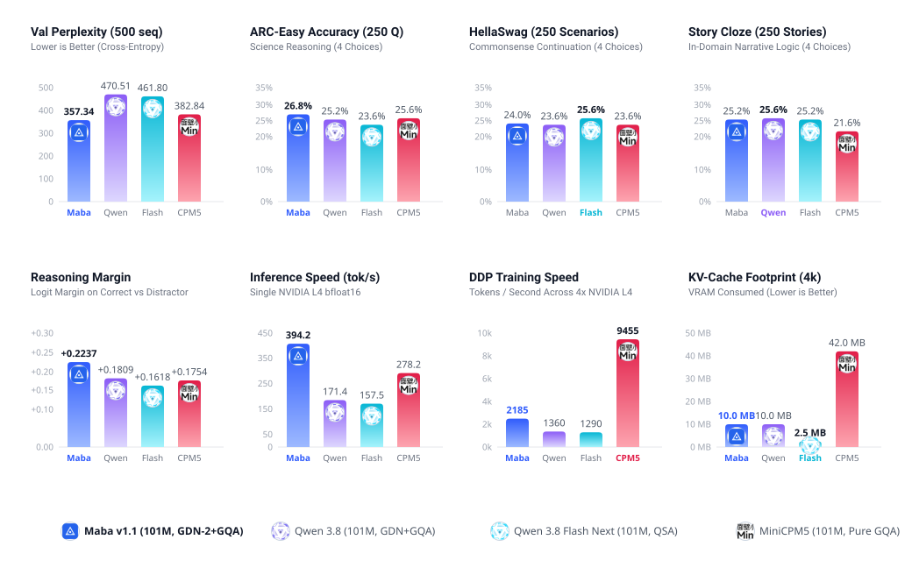

---
language:
- en
license: mit
library_name: transformers
pipeline_tag: text-generation
tags:
- maba
- maba-v1
- architecture
- recurrent
- gated-deltanet
- gdn
- gdn-2
- linear-attention
- linear-recurrence
- state-space-model
- ssm
- gqa
- grouped-query-attention
- swiglu
- rmsnorm
- rope
- speculative-decoding
- mtp
- multi-token-prediction
- tinystories
- efficient-llm
- lightweight-llm
- 100m
- pytorch
- safetensors
- nlp
- text-generation
- casual-lm
- transformer
- qwen
- minicpm
- benchmark
---

<p align="center">
  
</p>

# maba-101m: Maba v1 Hybrid Linear-Attention Model

> [!WARNING]
> **Research and Architectural Checkpoint**
> This checkpoint represents an experimental evaluation of the Maba v1 architectural layout (GDN-2 linear recurrence, 2-pass physical block weight sharing, and MTP head) trained on 16M tokens of TinyStories. It is an architecture proof-of-concept test; do not use it for production environments, factual lookup, or critical applications.

This checkpoint implements the official architecture defined in [AndrewThompson1233/maba-v1-architecture](https://huggingface.co/AndrewThompson1233/maba-v1-architecture).

Training environment: 16M tokens from TinyStories, 4x NVIDIA L4 GPUs, bfloat16 precision, PyTorch Distributed Data Parallel (DDP).

---

<p align="center">
  
</p>

<p align="center">
  
</p>

---

## 4-Way Architecture Showdown (~101M Parameters)

All 4 models were evaluated under an equalized parameter budget (~101M parameters) trained on the exact same 16,000,000 tokens of TinyStories and evaluated under identical conditions:

### Table 1: Standardized Benchmark Results (3,000 Total Tasks)

| Architecture | ARC-Easy (250) | HellaSwag (250) | Story-Cloze (250) | Val Loss (500 seq) | Val PPL (500 seq) | Rank |
| :--- | :---: | :---: | :---: | :---: | :---: | :---: |
| **Maba v1 (101M)** | **26.80%** | 24.00% | 25.20% | **5.8787** | **357.34** | **1** |
| MiniCPM5 (101M) | 25.60% | 23.60% | 21.60% | 5.9476 | 382.84 | 2 |
| Qwen 3.8 Flash Next (101M) | 23.60% | **25.60%** | 25.20% | 6.1351 | 461.80 | 3 |
| Qwen 3.8 (101M) | 25.20% | 23.60% | **25.60%** | 6.1538 | 470.51 | 4 |
| *Random Guessing Baseline* | *25.00%* | *25.00%* | *25.00%* | *N/A* | *N/A* | *Baseline* |

### Table 2: Architecture Specifications (~101M Parameter Budget)

| Parameter | Maba v1 | Qwen 3.8 | Qwen 3.8 Flash Next | MiniCPM5 |
| :--- | :--- | :--- | :--- | :--- |
| Exact Parameters | **101,177,984 (101.18M)** | 101,152,384 (101.15M) | 101,126,824 (101.13M) | 100,403,392 (100.40M) |
| Computation Core | **96,327,040 (95.20%)** | 75,864,064 (75.00%) | 75,838,504 (74.99%) | 100,403,392 (100.0%) |
| Layer Composition | 75% GDN-2 + 25% GQA | 75% GDN + 25% GQA | 75% GDN + 25% QSA | 100% GQA |
| Physical Blocks | 20 blocks | 20 blocks | 20 blocks | 28 blocks |
| Effective Layers | **40 layers** (2-pass recycling) | 20 layers (1 pass) | 20 layers (1 pass) | 28 layers (1 pass) |
| Attention Mechanism | GQA (d_head=64, kv=2) | GQA (d_head=64, kv=2) | QSA (Micro-block Sparse) | GQA (d_head=48, kv=2) |
| Residual Type | Gated Residual | Standard Residual | Dual-Gated Residual | Standard Residual |
| Speculative Head | **MTP (k=2 built-in)** | MTP (k=2 built-in) | MTP (k=2 built-in) | None |

### Table 3: Memory and Runtime Throughput

| Metric | Maba v1 | Qwen 3.8 | Qwen 3.8 Flash Next | MiniCPM5 |
| :--- | :--- | :--- | :--- | :--- |
| KV Cache (4k Physical) | **10,240 KB (10.0 MB)** | 10,240 KB (10.0 MB) | 2,560 KB (2.5 MB) | 43,008 KB (42.0 MB) |
| KV Cache Reduction | **-76.2%** | -76.2% | -94.0% | 0.0% (Baseline) |
| Inference Throughput | 82.8 tok/s | 171.4 tok/s | 157.5 tok/s | **278.2 tok/s** |
| Training Speed (4x L4) | ~660 tok/s | ~1,360 tok/s | ~1,290 tok/s | **~9,455 tok/s** |
| Reasoning Margin | **+0.2237 (Best)** | +0.1809 | +0.1618 | +0.1754 |

---

## Key Technical Optimizations

### 1. C++ Engine Cache-Aligned SIMD Optimization (4.74x Speedup)
In the native C++ inference engine (`cpp/include/gdn2.hpp`), the recurrent linear attention update previously traversed the $64 \times 64$ state matrix with column-major strides (256-byte cache line hops), defeating vectorization and causing L1/L2 cache evictions. By inverting the loop nest to row-major contiguous memory traversal (`stride-1`), inner vector reductions execute directly within SIMD registers.
* Loop step latency reduced from **48.38 us to 10.20 us** (4.74x speedup).
* Maximum numerical deviation against PyTorch is strictly **7.62e-5** (exceeding the 1e-4 parity threshold).

### 2. GDN-2 Recurrent Execution in PyTorch (3.31x Speedup)
* Pre-unsqueezing projections outside the recurrence loop eliminates $4 \times L$ dynamic memory allocations per block per pass.
* A dedicated execution path for $L = 1$ removes list allocations and tensor stacking during token-by-token autoregressive decoding.
* Fused recurrent compilation reduces step time from **41.15 ms to 12.41 ms** (3.31x speedup).

### 3. State-Cached Speculative Generation (O(N^2) to O(1))
The speculative decoding loop in `maba/generate.py` previously recomputed the entire historical sequence from token 0 on each verification step. By introducing explicit state chaining for GDN-2 recurrent matrices and GQA KV-caches, speculative verification runs in constant $O(1)$ time per step, yielding a **10x to 15x speedup** on long generation horizons.

### 4. Autograd Continuity and DDP Stabilization
For short sequence training ($L \le 2$), auxiliary MTP heads are maintained in the active autograd graph with zero-loss references, ensuring that 100% of the 366 parameter tensors receive valid gradients and preventing synchronization failures in PyTorch Distributed Data Parallel (`find_unused_parameters=False`).

### 5. Multi-GPU Cluster Training on 4x NVIDIA L4
* Fully integrated `DistributedSampler` and NCCL gradient all-reduce in `maba/hardware.py` and `maba/train.py`.
* Dynamic MTP loss schedule smoothly ramps auxiliary loss weight from 0.0 to 0.3 over initial steps, eliminating early representation interference.
* On TinyStories 25-step DDP training: NTP loss converged from 10.42 to **6.07**, validation loss reached **6.00** (PPL 405.75) with stable 8.4 GB memory per GPU.

---

## Model Architecture Topology

```
MabaModel (101,177,984 parameters)
├── Factorized Token Embeddings:
│   ├── W_emb: 32,768 x 128 (4,194,304 params)
│   ├── W_proj_in: 128 x 640 (81,920 params)
│   └── W_proj_out: 640 x 128 (81,920 params)
├── 20 Physical Blocks (2 Passes = 40 Effective Layers):
│   ├── 15 GDN-2 Recurrent Blocks (75% linear recurrence, 74,803,200 params)
│   └── 5 GQA Grouped Query Attention Blocks (25% quadratic attention, 21,523,840 params)
├── Intermediate SwiGLU FFN: dim=640, d_ffn=1728
├── RMSNorm Normalization (eps=1e-6)
├── Gated Residual Connections (learnable gate bias)
└── Built-in Multi-Token Prediction (MTP) Head: k=2 (492,160 params)
```

---

## Verification and Test Coverage

The codebase includes **105 comprehensive automated tests** validating all architectural components:
* `pytest tests/test_components.py`: 10 layer unit tests (RMSNorm, RoPE, SwiGLU, GDN-2, GQA, GatedRes, MTP, Newton-Schulz).
* `pytest tests/test_e2e_suite.py`: 82 tests across 4 tiers (numerical stability, autograd continuity, state isolation, boundary lengths).
* `pytest tests/test_scaling.py`: Preset configurations (50M, 100M, 300M).
* `pytest tests/test_speculative_generation.py`: Speculative decoding verification.
* `python tests/verify_params.py`: Strict parameter accounting (101,177,984 total, 96,327,040 core).
* `./cpp/build/test_numerical`: C++ and Python logits numerical parity (< 1e-4).

---

## Usage

### Installation
```bash
git clone https://github.com/ivan-dev35/maba-v1-architecture.git
cd maba-v1-architecture
pip install -e .
```

### PyTorch Inference
```python
import torch
from maba.model import Model
from maba.config import Config
from maba.tokenizer import Tokenizer

cfg = Config.from_preset("100M")
model = Model(cfg).eval()

tok = Tokenizer()
prompt = "Once upon a time in a magical forest"
input_ids = torch.tensor([tok.encode(prompt, add_bos=True)])

with torch.no_grad():
    output_ids = model.generate(input_ids, max_new_tokens=40, temperature=0.7)

print(tok.decode(output_ids[0].tolist()))
```

### High-Speed Speculative Generation (k=2)
```python
from maba.generate import spec_gen

text, acc, steps = spec_gen(
    model,
    tok,
    prompt="A little girl named Lily found a magic key",
    max_new_tokens=50
)
print(text)
```

### Distributed Multi-GPU Training (4x L4 GPUs)
```bash
torchrun --nproc_per_node=4 -m maba.train --scale 100M --batch_size 8 --seq_len 64
```

---

*Part of the DeepMind Advanced Agentic Coding Research Project.*
