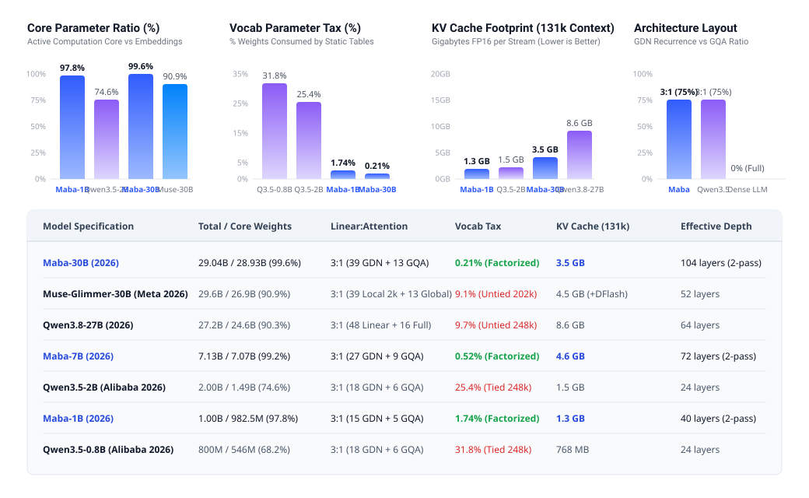

# Maba Architecture: Scaling and 2026 Architectural Comparison

Technical specification and architectural comparison for scaling the Maba architecture from 100M to 1B, 3B, 7B, and 30B parameters against 2026 frontier and edge architectures.

---

## 1. Visual Comparison



---

## 2. Scaling Topology Presets

| Metric | Maba-100M | Maba-1B | Maba-3B | Maba-7B | Maba-30B (Agentic) |
| :--- | :--- | :--- | :--- | :--- | :--- |
| **Total Parameters** | 101,183,744 (101.2M) | 1,004,748,800 (1.00B) | 2,977,199,616 (2.98B) | 7,127,891,968 (7.13B) | 29,039,982,592 (29.04B) |
| **Core Parameters** | 96,332,800 (95.21%) | 982,528,000 (97.79%) | 2,941,345,792 (98.80%) | 7,071,916,032 (99.21%) | 28,930,982,912 (99.62%) |
| **Embedding Parameters** | 4,358,144 (4.31%) | 17,498,112 (1.74%) | 26,836,992 (0.90%) | 37,093,376 (0.52%) | 59,572,224 (0.21%) |
| **Vocab Tax** | 4.31% | 1.74% | 0.90% | 0.52% | 0.21% |
| **Vocabulary Size (V)** | 32,768 | 64,256 | 64,256 | 64,256 | 64,256 |
| **Embedding Rank (d_emb)** | 128 | 256 | 384 | 512 | 768 |
| **Model Dimension (dim)** | 640 | 2048 | 2816 | 4096 | 6656 |
| **Physical Blocks** | 20 | 20 | 32 | 36 | 52 |
| **Effective Depth (2-pass)** | 40 layers | 40 layers | 64 layers | 72 layers | 104 layers |
| **Block Ratio (GDN:GQA)** | 3:1 (15 GDN + 5 GQA) | 3:1 (15 GDN + 5 GQA) | 3:1 (24 GDN + 8 GQA) | 3:1 (27 GDN + 9 GQA) | 3:1 (39 GDN + 13 GQA) |
| **Query Heads (n_heads)** | 10 | 16 | 22 | 32 | 52 |
| **KV Heads (n_kv_heads)** | 2 | 4 | 4 | 8 | 4 |
| **Head Dimension (d_head)** | 64 | 128 | 128 | 128 | 128 |
| **FFN Dimension (d_ffn)** | 1728 | 5504 | 7488 | 11008 | 19968 |
| **Conv Kernel (k_size)** | 4 | 4 | 4 | 4 | 4 |
| **Context Length (max_len)** | 4096 | 8192 | 16384 | 32768 | 131072 |
| **Speculative Horizon** | k=2 (Built-in MTP) | k=2 (Built-in MTP) | k=2 (Built-in MTP) | k=2 (Built-in MTP) | k=2 (Built-in MTP) |

---

## 3. Comparison Against 2026 Architectures

### Agentic Tier (27B - 31B)

| Feature | Maba-30B (2026) | Muse-Glimmer-30B (Meta 2026) | Qwen3.8-27B (2026) | Gemma4-31B (Google 2026) |
| :--- | :--- | :--- | :--- | :--- |
| **Backbone Architecture** | GDN-2 Linear Recurrence + GQA | Dense Transformer + Local Window | Linear Attention + Full Attention | Dense Transformer |
| **Total Parameters** | 29.04B | 29.6B (incl. 1.8B ViT-G) | 27.2B | 30.7B |
| **Core Computation Parameters** | 28.93B (99.62%) | 26.9B (90.9%) | 24.6B (90.3%) | 27.1B (88.4%) |
| **Vocab Parameter Tax** | 0.21% (Rank-768 Factorized) | 9.1% (Untied 202k Vocab) | 9.7% (Untied 248k Vocab) | 11.6% (Direct 256k Vocab) |
| **Layer Mixture** | 75% GDN-2 + 25% GQA | 75% Local Window (2k) + 25% Global | 75% Linear Attn + 25% Full Attn | 100% Full Attention |
| **Attention Layers With State Growth** | 13 layers (25%) | 13 global + 39 local window | 16 layers (25%) | 54 layers (100%) |
| **KV Cache Footprint (131k FP16)** | 3.5 GB | 4.5 GB (1.8 GB + 2.7 GB drafter) | 8.6 GB | 28.3 GB |
| **Speculative Decoding Mechanism** | Built-in MTP (k=2, 0 extra VRAM) | DFlash block-diffusion (5-layer companion) | MTP auxiliary layer (k=2) | None / external drafter |
| **Effective Layer Depth** | 104 layers (2-pass block) | 52 layers | 64 layers | 54 layers |

### Mid Tier (7B - 8B)

| Feature | Maba-7B (2026) | Qwen3-8B (2026) | IFM/K2-Horizon-7B (2026) |
| :--- | :--- | :--- | :--- |
| **Backbone Architecture** | GDN-2 Linear Recurrence + GQA | Qwen3 Dense Transformer | Dense Transformer |
| **Total Parameters** | 7,127.9M (7.13B) | 8,280.4M (8.28B) | 7,974.7M (7.97B) |
| **Core Computation Parameters** | 7,071.9M (99.21%) | 7,035.8M (84.97%) | 6,948.1M (87.13%) |
| **Vocab Parameter Tax** | 0.52% (Rank-512 Factorized) | 15.03% (Untied 152k Vocab) | 12.87% (Tied 250k Vocab) |
| **Layer Mixture** | 75% GDN-2 + 25% GQA | 100% Full Attention | 100% Full Attention |
| **KV Cache Layers** | 9 layers (25%) | 36 layers (100%) | 36 layers (100%) |
| **KV Cache Footprint (131k FP16)** | 4,608.0 MB (4.6 GB) | 19,327.4 MB (19.3 GB) | 18,432.0 MB (18.4 GB) |
| **KV Cache Reduction vs Competitor** | Reference | -76.2% memory vs Qwen3-8B | -75.0% memory vs K2-Horizon-7B |
| **Speculative Decoding** | Built-in MTP (k=2) | k=1 | k=1 |
| **Effective Layer Depth** | 72 layers | 36 layers | 36 layers |

### Edge Tier (1.7B - 4B)

| Feature | Maba-3B (2026) | openbmb/MiniCPM5-2B (2026) | XHToken/Spark-X2.5-4B (2026) |
| :--- | :--- | :--- | :--- |
| **Backbone Architecture** | GDN-2 Linear Recurrence + GQA | Dense Transformer | Spark Transformer |
| **Total Parameters** | 2,977.2M (2.98B) | 2,246.5M (2.25B) | 3,758.1M (3.76B) |
| **Core Computation Parameters** | 2,941.3M (98.80%) | 1,979.4M (88.11%) | 3,422.5M (91.07%) |
| **Vocab Parameter Tax** | 0.90% (Rank-384 Factorized) | 11.89% (130k Vocab) | 8.93% (131k Vocab) |
| **KV Cache Layers** | 8 layers (25%) | 42 layers (100%) | 36 layers (100%) |
| **KV Cache Footprint (131k FP16)** | 2,048.0 MB (2.0 GB) | 5,376.0 MB (5.4 GB) | 11,520.0 MB (11.5 GB) |
| **KV Cache Reduction** | Reference | -61.9% memory vs MiniCPM5-2B | -82.2% memory vs Spark-4B |
| **Speculative Decoding** | Built-in MTP (k=2) | k=1 | k=1 |
| **Effective Layer Depth** | 64 layers | 42 layers | 36 layers |

### Compact Tier (0.8B - 1B)

| Feature | Maba-1B (2026) | IFM/K2-Horizon-0.9B (2026) | openbmb/MiniCPM5-1B (2026) |
| :--- | :--- | :--- | :--- |
| **Backbone Architecture** | GDN-2 Linear Recurrence + GQA | Dense Transformer | Dense Transformer |
| **Total Parameters** | 1,004.7M (1.00B) | 920.8M (0.92B) | 840.4M (0.84B) |
| **Core Computation Parameters** | 982.5M (97.79%) | 822.1M (89.28%) | 639.8M (76.13%) |
| **Vocab Parameter Tax** | 1.74% (Rank-256 Factorized) | 10.72% (64k Vocab) | 23.87% (130k Vocab) |
| **KV Cache Layers** | 5 layers (25%) | 28 layers (100%) | 24 layers (100%) |
| **KV Cache Footprint (131k FP16)** | 1,280.0 MB (1.3 GB) | 5,376.0 MB (5.4 GB) | 2,304.0 MB (2.3 GB) |
| **KV Cache Reduction** | Reference | -76.2% memory vs K2-Horizon-0.9B | -44.4% memory vs MiniCPM5-1B |
| **Speculative Decoding** | Built-in MTP (k=2) | k=1 | k=1 |
| **Effective Layer Depth** | 40 layers | 28 layers | 24 layers |

### Sub-150M Tier

| Feature | Maba-100M (2026) | Supra2-100M (2026) | SmolLM2-135M | MobileLLM-125M |
| :--- | :--- | :--- | :--- | :--- |
| **Backbone** | Maba (GDN-2 + GQA) | Qwen3 (Transformer) | Transformer | Transformer |
| **Total Parameters** | 101.18M | 100.68M | 135.0M | 125.0M |
| **Core Parameters** | 96.33M (95.21%) | 75.52M (75.01%) | 106.7M (79.04%) | 106.6M (85.28%) |
| **Vocab Tax** | 4.31% | 24.99% | 20.96% | 14.72% |
| **KV Cache Layers** | 5 layers (25%) | 12 layers (100%) | 30 layers (100%) | 30 layers (100%) |
| **Effective Depth** | 40 layers | 12 layers | 30 layers | 30 layers |
| **Speculative Horizon** | k=2 (Built-in MTP) | k=1 | k=1 | k=1 |

---

## 4. KV-Cache Memory Footprint

In quadratic attention architectures, every layer allocates key-value cache with memory complexity O(N).
In Maba, 75% of layers are GDN-2 linear recurrence blocks with a constant hidden state (dim x dim) that does not grow with context length. Only the 25% GQA layers store token history.

The table below reports single-stream FP16 KV-cache memory in megabytes (MB) across sequence lengths:

$$\mathrm{KV~Cache~Memory} = 4 \times N_{\mathrm{gqa}} \times n_{\mathrm{kv}} \times d_{\mathrm{head}} \times S$$

| Model Scale | Model | 32,768 Tokens | 65,536 Tokens | 131,072 Tokens | Reduction vs Baseline |
| :--- | :--- | :--- | :--- | :--- | :--- |
| **30B Tier** | **Maba-30B** | **873.8 MB** | **1,747.6 MB** | **3,495.3 MB (3.5 GB)** | **Reference** |
| 30B Tier | Muse-Glimmer-30B | 1,126.0 MB | 2,252.0 MB | 4,504.0 MB (4.5 GB) | -22.4% |
| 30B Tier | Qwen3.8-27B | 2,147.5 MB | 4,295.0 MB | 8,589.9 MB (8.6 GB) | -59.3% |
| 30B Tier | Gemma4-31B | 7,077.9 MB | 14,155.8 MB | 28,311.6 MB (28.3 GB) | -87.7% |
| **7B Tier** | **Maba-7B** | **1,152.0 MB** | **2,304.0 MB** | **4,608.0 MB (4.6 GB)** | **Reference** |
| 7B Tier | IFM/K2-Horizon-7B | 4,608.0 MB | 9,216.0 MB | 18,432.0 MB (18.4 GB) | -75.0% |
| 7B Tier | Qwen3-8B | 4,831.8 MB | 9,663.7 MB | 19,327.4 MB (19.3 GB) | -76.2% |
| **3B Tier** | **Maba-3B** | **512.0 MB** | **1,024.0 MB** | **2,048.0 MB (2.0 GB)** | **Reference** |
| 3B Tier | MiniCPM5-2B | 1,344.0 MB | 2,688.0 MB | 5,376.0 MB (5.4 GB) | -61.9% |
| 3B Tier | Spark-X2.5-4B | 2,880.0 MB | 5,760.0 MB | 11,520.0 MB (11.5 GB) | -82.2% |
| **1B Tier** | **Maba-1B** | **320.0 MB** | **640.0 MB** | **1,280.0 MB (1.3 GB)** | **Reference** |
| 1B Tier | MiniCPM5-1B | 576.0 MB | 1,152.0 MB | 2,304.0 MB (2.3 GB) | -44.4% |
| 1B Tier | K2-Horizon-0.9B | 1,344.0 MB | 2,688.0 MB | 5,376.0 MB (5.4 GB) | -76.2% |

---

## 5. Mathematical Parameter Formulations

The exact parameter counts for all Maba configurations are defined by the following closed-form expressions (with zero KaTeX mode errors):

### Factorized Embeddings
$$W_{\mathrm{emb}} = V \cdot d_{\mathrm{emb}} + 2 \cdot d_{\mathrm{emb}} \cdot d_{\mathrm{model}}$$

### GDN-2 Recurrent Block
$$P_{\mathrm{gdn2}} = 4 d^2 + 3 d \cdot d_{\mathrm{ffn}} + 3 d \cdot k_{\mathrm{conv}} + 3 d \cdot n_{\mathrm{heads}} + 6 d$$

### GQA Attention Block
$$P_{\mathrm{gqa}} = 2 d^2 + 2 d (n_{\mathrm{kv}} \cdot d_{\mathrm{head}}) + 3 d \cdot d_{\mathrm{ffn}} + 8 d$$

### Auxiliary Multi-Token Prediction Head (k=2)
$$P_{\mathrm{mtp}} = d (d + d_{\mathrm{emb}}) + d$$

### Total Architecture Parameters
$$P_{\mathrm{total}} = W_{\mathrm{emb}} + N_{\mathrm{gdn}} \cdot P_{\mathrm{gdn2}} + N_{\mathrm{gqa}} \cdot P_{\mathrm{gqa}} + d_{\mathrm{model}} + P_{\mathrm{mtp}}$$

---

## 6. Instantiation and Zero-RAM Verification

### Python API

```python
from maba.config import Config
from maba.model import Model
import torch

# Load configuration presets
cfg_1b = Config.from_preset("1B")
cfg_3b = Config.from_preset("3B")
cfg_7b = Config.from_preset("7B")
cfg_30b = Config.from_preset("30B")

# Zero-RAM algebraic parameter audit
audit = cfg_30b.compute_param_count()
print(f"Total: {audit['total']:,} | Vocab tax: {audit['vocab_tax_pct']}% | Core: {audit['core_pct']}%")

# Memory-safe PyTorch instantiation on meta device (0 bytes allocated in RAM)
with torch.device("meta"):
    model_30b = Model(cfg_30b)
    meta_params = sum(p.numel() for p in model_30b.parameters())
    print(f"Instantiated 30B parameters on meta device: {meta_params:,}")
```

### CLI Command

```bash
# Audit 100M configuration
python3 -m maba.cli params --scale 100M

# Audit 1B configuration
python3 -m maba.cli params --scale 1B

# Audit 3B configuration
python3 -m maba.cli params --scale 3B

# Audit 7B configuration
python3 -m maba.cli params --scale 7B

# Audit 30B agentic configuration
python3 -m maba.cli params --scale 30B
```
